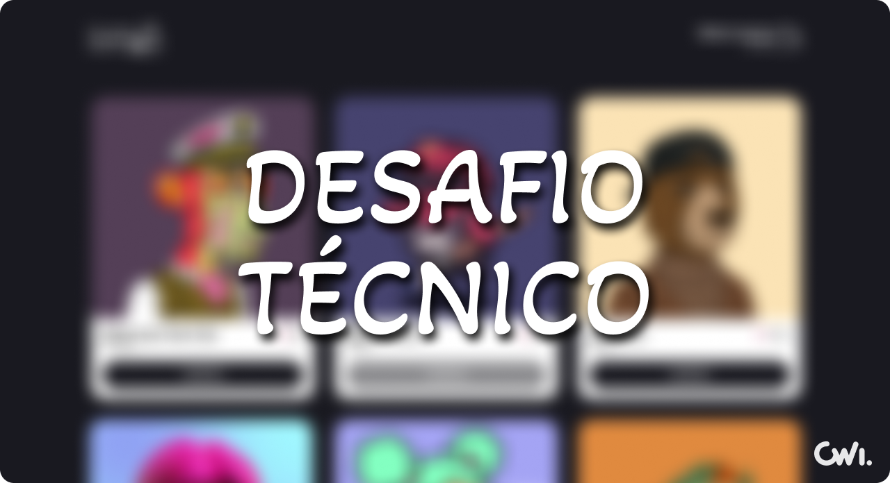

A seguir você encontrará instruções para realizar este desafio técnico. Caso haja qualquer dúvida ou sugestão durante o processo você pode abrir uma [nova discussão aqui](https://github.com/emilioheinz/technical-test/discussions).

## 🚀 Tecnologias
É preferível que você use as tecnologias listadas a baixo para resolver os problemas propostos pelo nosso time, são elas que usamos em 90% do nosso tempo: 
- ReactJS
- TypeScript
- NextJS
- Alguma ferramenta de estilização da sua escolha

> "😪 Ahhh, nunca usei TypeScript, essa vaga não é pra mim!"

Calma lá! Não tem problema nenhum. Estamos buscando pessoas que saibam resolver problemas. Nesse caso você pode utilizar o que você tem domínio que a gente vai avaliar da mesma forma 😉

## 📦 Como enviar a solução para nós

1. Crie um repositório público no GitHub;
2. Clone o repositório na sua máquina;
3. Desenvolva a solução do problema;
4. Suba o código escrito no repositório;
5. Envie o link do repositório para nós avaliarmos.

## ✅ O que será avaliado
- Qualidade do código;
- Componentização;
- Organização das pastas;
- Fidelidade ao layout;
- Responsividade;
- Fidelidade aos requisitos do software.
  
## 👷🏼‍♂️ O que iremos disponibilizar
- Layout para todas as telas e estados da aplicação;
- Uma API para consulta dos dados necessários para desenvolvimento do desafio;
- Suporte para dúvidas pontuais quanto ao desafio.

## 🔥 O desafio

O objetivo desse desafio é criar uma pequena lojinha de [NFTs](https://www.google.com/search?q=O+que+%C3%A9+um+NFT%3F) onde teremos uma listagem dos NFTs disponíveis para compra e a possibilidade de adicioná-los a uma carteira.

### ➡️ Requisitos do software:
- Ao acessar a home da aplicação o usuário deve ver uma listagem dos NFTs disponíveis para compra.
- Enquanto os NFTs estão sendo buscados da API um loader deve ser exibido.
- O usuário pode adicionar um NFT a sua carteira. 
- Um NFT não pode ser adicionado mais de uma vez a carteira do usuário.
- Na listagem, cada NFT deve apresentar uma imagem, a coleção a qual ele pertence, o seu ID e o seu preço.
- No topo de todas as telas deve ser apresentado um Header. 
- O Header deve apresentar o Logo da loja e um link de acesso a carteira com um contador da quantidade de itens presentes nela.
- Ao clicar no logo da loja o usuário deve ser redirecionado para a Home. 
- Ao clicar na carteira o usuário deve ser redirecionado para a sua carteira.
- Quando a quantidade de itens na carteira do usuário for atualizada o contador no header deve ser atualizado também.
- Ao acessar a sua carteira o usuário deve visualizar os NFTs adicionados a ela.
- Na listagem de NFTs da carteira, cada NFT deve apresentar uma imagem, a coleção a qual ele pertence, seu ID, preço e um botão para removê-lo da carteira. 
- Ao pressionar o botão de remover o NFT da carteira o NFT deve ser removido e a listagem atualizada.
- A carteira deve também apresentar um resumo dos NFTs que estão sendo comprados.
- O resumo deve apresentar ID, preço em Ether e em Reais de cada NFT.
- O resumo deve apresentar o valor total, em Ether e Reais, da soma de todos os NFTs presentes na carteira.
- Ao recaregar qualquer página os itens presentes na carteira do usuário devem ser persistidos.

### 💅🏼 Layout

Link para o layou: [https://www.figma.com/technical-test](https://www.figma.com/file/aPYbjgTxVM9NgKyvwaKUi2/Arezzo%26Co-Store?node-id=0%3A1)

Para ter acesso completo ao layout você precisa copia-lo para dentro da sua conta. Só assim você poderá visualizar as cores e baixar os assets utilizados para construção do layout.

Para entender melhor como fazer isso você pode acessar a [documentação oficial do Figma](https://help.figma.com/hc/en-us/articles/360038511533-Duplicate-files) sobre o assunto e ler a seção **B Editor**, lá você encontrará em detalhes como proceder.

### 💨 API
Para consumir os dados disponibilizados por nós no arquivo `server.json` utilizaremos o [JSON Server](https://www.npmjs.com/package/json-server). Dessa forma será possível simular uma API baseada em um arquivo `JSON` local. 

Instale o JSON Server:

```
npm install -g json-server
```

Copie o conteúdo do arquivo `server.json` deste repositório e o coloque na raiz do seu projeto. Para fazer isso de forma mais simples e prática você pode copiar o comando a baixo e roda-lo na raiz do seu projeto.

```
touch server.json && curl https://raw.githubusercontent.com/emilioheinz/technical-test/main/server.json > server.json
```

Inicie o JSON Server apontando para o arquivo criado:

```
json-server --watch server.json --delay 500 --port 4000
```

Agora para garantir que a API está rodando, você deve acessar [http://localhost:4000/nfts](http://localhost:4000/nfts) no seu browser. Caso o conteúdo do arquivo `server.json` for retornando você está pronto para começar o desafio.

### 🚨 Observações
Não se esqueça de documentar o passo a passo que deve ser seguido para que consigamos rodar o seu projeto. Isso é muito importante para que possamos avalia-lo posteriormente.